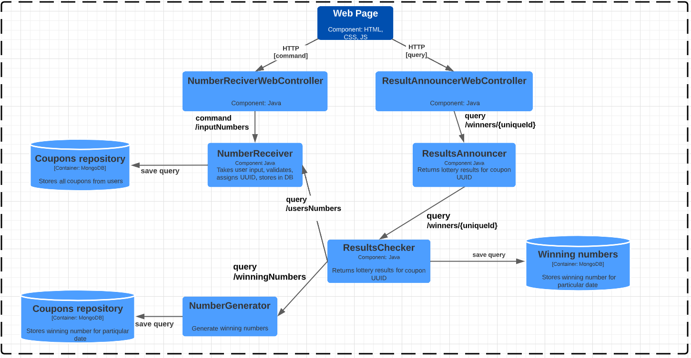

## Lotter Web
### _Number lottery game - Spring Boot application (backend project)_
#### Lotto|Web is an online version of the popular number lottery game. To participate, users select six different numbers between 1 and 99 and receive a unique coupon identifier. Once a week, winning numbers are randomly selected, and all submitted coupons are processed to determine winners. In order to win a prize, a user must have at least three numbers that match the winning numbers drawn for that week. Users can check their results at any time using their unique coupon identifier.

#### All user coupons, generated winning numbers, and processed results are stored in a separate database using SpringData with MongoDB. A scheduler has been configured to run the lottery once per week and collect all coupons submitted for the current draw date. The scheduler will then process the coupons according to the game rules and determine all winners and losers. Once processing is complete, users can check their results using their unique coupon ID and claim any prizes they have won.

## Specification

 1.  Spring Boot, web application
 2.  Modular monolith hexagonal architecture
 3.  Facade design pattern
 4.  NoSQL databases (MongoDB) for coupon and results repositories
 5.  There is good test coverage, including both unit tests and "happy path" integration tests.
 6. The controllers have been tested using mockMvc, and the winning numbers service has been stubbed using WireMock.
 7.  Scheduled lottery run and results processing
 
## Tech:
Lotto|Web is developed using following technologies:

Core:

 

 


Testing: 

 





_#_# How to build the project on your own
#### To build the project:

##### 1. Clone the repository: #####

```bash
git clone https://github.com/GrzegorzHolui/LottoExcelent.git
```
##### 2. Go to the folder with cloned repository #####

##### 3. Run the command: #####

```bash
mvn package -DskipTests
```

##### 4. In folder target you should find a file named: application-{version}-SNAPSHOT.jar #####


#### To build the docker image with Docker Compose: ####

##### 1. Clone the repository: #####
```bash
git clone https://github.com/GrzegorzHolui/LottoExcelent.git
```

##### 2. Go to the folder with cloned repository: #####


##### 3. Run the command: #####
```bash
docker-compose build
```

##### 4. By using #####
```bash
docker images
```


